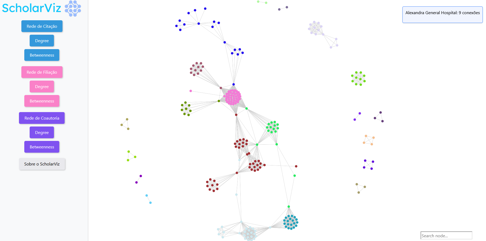

# ScholarViz
The system created for visualizing networks was named ScholarViz, a combination of the words "Scholar", which suggests a connection with the academic world, research, or education, and the abbreviation "Visualization", indicating the visual representation of data or information.

# Content
* [RedesIgraph](https://github.com/SaraO3O/ScholarViz/tree/main/RedesIgraph "RedesIgraph") - Filtering the database and building networks in Igraph.
* [ScholarViz](https://github.com/SaraO3O/ScholarViz/tree/main/ScholarViz "ScholarViz") - Tool for visual analysis of scientific articles on COVID-19.
* [Script](https://github.com/SaraO3O/ScholarViz/tree/main/Script "Script") - Code created to transform an Igraph-formatted graph into a JSON file in the format of a Sigma.js graph.

## About the database
The dataset "COVID-19 Open Research Dataset Challenge (CORD-19)" by [Wang et al. (2020)](https://www.ncbi.nlm.nih.gov/pmc/articles/PMC7251955/), is a rapidly expanding source of scientific articles on COVID-19 and other coronavirus-related research. CORD-19 comprises over 1,000,000 academic papers, with approximately 400,000 containing full-text content. The dataset is available on the [Kaggle](https://www.kaggle.com/datasets/allen-institute-for-ai/CORD-19-research-challenge) platform for the global research community to generate new insights and perspectives on the subject.
